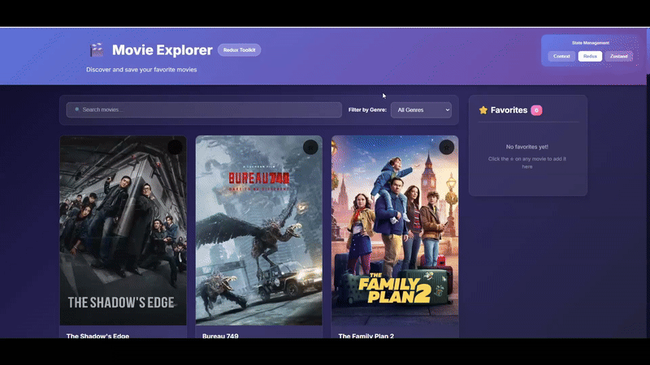

# 🎬 MovieDB Explorer - Projet Comparatif

Une application de découverte de films utilisant l'API TMDb, implémentée avec **trois solutions de gestion d'état différentes** : Context API, Redux Toolkit, et Zustand.

## 📋 Table des Matières

- [Aperçu](#aperçu)
- [Fonctionnalités](#fonctionnalités)
- [Technologies Utilisées](#technologies-utilisées)
- [Installation](#installation)
- [Structure du Projet](#structure-du-projet)
- [Comparaison des Solutions](#comparaison-des-solutions)
- [Captures d'Écran](#captures-décran)
- [API TMDb](#api-tmdb)

---

## 🎯 Aperçu

Ce projet est une application web moderne permettant de découvrir des films populaires, de les rechercher par titre, de les filtrer par genre, et de gérer une liste de favoris. L'objectif principal est de **comparer trois approches différentes de gestion d'état** dans React.

### Versions Implémentées

1. **Context API** - Solution native de React
2. **Redux Toolkit** - Bibliothèque de gestion d'état robuste
3. **Zustand** - Solution légère et moderne

---

## ✨ Fonctionnalités

### Fonctionnalités Principales

- ✅ **Chargement des films populaires** depuis l'API TMDb
- ✅ **Système de favoris** avec icône étoile interactive
- ✅ **Filtrage par genre** avec sélecteur dropdown
- ✅ **Recherche par titre** avec debouncing (500ms)
- ✅ **Affichage des favoris** dans une sidebar dédiée
- ✅ **Interface responsive** adaptée à tous les écrans
- ✅ **Design moderne** avec glassmorphism et animations

### Fonctionnalités Techniques

- 🔄 Gestion d'état synchronisée entre les trois versions
- 🎨 CSS commun partagé entre toutes les versions
- ⚡ Optimisation des performances (lazy loading des images)
- 🔍 Recherche avec debouncing pour réduire les appels API
- 📱 Design responsive (mobile, tablette, desktop)
- 🎭 Animations et transitions fluides

---

## 🛠️ Technologies Utilisées

### Core

- **React 19.2.0** - Bibliothèque UI
- **Vite 7.2.2** - Build tool et dev server
- **JavaScript (ES6+)** - Langage de programmation

### Gestion d'État

- **Context API** - Solution native React
- **Redux Toolkit 2.11.0** - Gestion d'état avec Redux
- **Zustand 5.0.8** - Gestion d'état légère

### API

- **TMDb API** - The Movie Database API
- **Fetch API** - Pour les requêtes HTTP

### Styling

- **CSS3** - Avec variables CSS, Grid, Flexbox
- **Glassmorphism** - Effets de verre moderne
- **Animations CSS** - Transitions et keyframes

---

## 📦 Installation

### Prérequis

- Node.js (v18 ou supérieur)
- npm ou yarn
- Clé API TMDb (déjà incluse dans `.env`)

### Étapes d'Installation

```bash
# 1. Cloner le repository
git clone <repository-url>
cd react-tp3

# 2. Installer les dépendances
npm install

# 3. Vérifier le fichier .env
# Le fichier .env contient déjà la clé API TMDb
# VITE_TMDB_API_KEY=b85b4d20***686***8d03381ooo

# 4. Lancer le serveur de développement
npm run dev

# 5. Ouvrir dans le navigateur
# http://localhost:5173
```

### Scripts Disponibles

```bash
npm run dev      # Lancer le serveur de développement
npm run build    # Créer un build de production
npm run preview  # Prévisualiser le build de production
npm run lint     # Vérifier le code avec ESLint
```

---

## 📁 Structure du Projet

```
react-tp3/
├── src/
│   ├── components-context/       # Composants Context API
│   │   ├── Header.jsx
│   │   ├── FilterBar.jsx
│   │   ├── MovieCard.jsx
│   │   ├── MovieGrid.jsx
│   │   └── FavoritesSidebar.jsx
│   │
│   ├── components-redux/          # Composants Redux
│   │   ├── Header.jsx
│   │   ├── FilterBar.jsx
│   │   ├── MovieCard.jsx
│   │   ├── MovieGrid.jsx
│   │   └── FavoritesSidebar.jsx
│   │
│   ├── components-zustand/        # Composants Zustand
│   │   ├── Header.jsx
│   │   ├── FilterBar.jsx
│   │   ├── MovieCard.jsx
│   │   ├── MovieGrid.jsx
│   │   └── FavoritesSidebar.jsx
│   │
│   ├── context/                   # Context API
│   │   └── MoviesContext.jsx
│   │
│   ├── redux/                     # Redux Toolkit
│   │   ├── store.js
│   │   └── moviesSlice.js
│   │
│   ├── zustand/                   # Zustand
│   │   └── useMoviesStore.js
│   │
│   ├── utils/                     # Utilitaires
│   │   └── tmdbApi.js
│   │
│   ├── App.jsx                    # Composant principal avec switcher
│   ├── AppContext.jsx             # App Context API
│   ├── AppRedux.jsx               # App Redux
│   ├── AppZustand.jsx             # App Zustand
│   ├── main.jsx                   # Point d'entrée
│   └── styles.css                 # CSS commun
│
├── .env                           # Variables d'environnement
├── package.json                   # Dépendances
├── vite.config.js                 # Configuration Vite
└── README.md                      # Documentation
```

---

## 🔍 Comparaison des Solutions

### 1️⃣ Context API

#### ✅ Avantages

- **Natif à React** - Pas de dépendance externe
- **Simple à comprendre** - Courbe d'apprentissage faible
- **Léger** - Aucun bundle supplémentaire
- **Parfait pour les petits projets** - Idéal pour des états simples

#### ❌ Inconvénients

- **Performance** - Re-renders potentiellement excessifs
- **Boilerplate** - Nécessite Provider et Consumer
- **Debugging** - Moins d'outils de développement
- **Scalabilité** - Difficile pour les grandes applications

#### 💻 Exemple de Code

```jsx
// MoviesContext.jsx
const MoviesContext = createContext();

export const MoviesProvider = ({ children }) => {
  const [movies, setMovies] = useState([]);
  const [favorites, setFavorites] = useState([]);
  
  const toggleFavorite = (movieId) => {
    setFavorites(prev => 
      prev.includes(movieId) 
        ? prev.filter(id => id !== movieId)
        : [...prev, movieId]
    );
  };
  
  return (
    <MoviesContext.Provider value={{ movies, favorites, toggleFavorite }}>
      {children}
    </MoviesContext.Provider>
  );
};

// Utilisation dans un composant
const { toggleFavorite, favorites } = useMovies();
```

#### 📊 Métriques

- **Lignes de code** : ~110 lignes (MoviesContext.jsx)
- **Bundle size** : 0 KB (natif)
- **Complexité** : ⭐⭐ (2/5)
- **Performance** : ⭐⭐⭐ (3/5)

---

### 2️⃣ Redux Toolkit

#### ✅ Avantages

- **Prévisible** - Flux de données unidirectionnel
- **DevTools** - Excellents outils de debugging (Redux DevTools)
- **Middleware** - Support pour async, logging, etc.
- **Scalable** - Parfait pour les grandes applications
- **Time-travel debugging** - Historique des actions

#### ❌ Inconvénients

- **Boilerplate** - Plus de code à écrire
- **Courbe d'apprentissage** - Concepts à maîtriser (actions, reducers, slices)
- **Bundle size** - Augmente la taille du bundle
- **Overkill** - Peut être excessif pour les petits projets

#### 💻 Exemple de Code

```jsx
// moviesSlice.js
const moviesSlice = createSlice({
  name: 'movies',
  initialState: {
    movies: [],
    favorites: [],
  },
  reducers: {
    toggleFavorite: (state, action) => {
      const movieId = action.payload;
      if (state.favorites.includes(movieId)) {
        state.favorites = state.favorites.filter(id => id !== movieId);
      } else {
        state.favorites.push(movieId);
      }
    },
  },
});

// Utilisation dans un composant
const dispatch = useDispatch();
const favorites = useSelector(selectFavorites);
dispatch(toggleFavorite(movieId));
```

#### 📊 Métriques

- **Lignes de code** : ~120 lignes (moviesSlice.js + store.js)
- **Bundle size** : ~15 KB (gzipped)
- **Complexité** : ⭐⭐⭐⭐ (4/5)
- **Performance** : ⭐⭐⭐⭐⭐ (5/5)

---

### 3️⃣ Zustand

#### ✅ Avantages

- **Minimaliste** - API très simple
- **Léger** - Très petit bundle size
- **Pas de Provider** - Utilisation directe du hook
- **Performance** - Optimisé par défaut
- **TypeScript** - Excellent support TypeScript
- **Flexible** - Peut utiliser des middlewares

#### ❌ Inconvénients

- **Moins mature** - Communauté plus petite que Redux
- **DevTools** - Outils de debugging moins avancés
- **Documentation** - Moins de ressources disponibles

#### 💻 Exemple de Code

```jsx
// useMoviesStore.js
const useMoviesStore = create((set, get) => ({
  movies: [],
  favorites: [],
  
  toggleFavorite: (movieId) => {
    set((state) => ({
      favorites: state.favorites.includes(movieId)
        ? state.favorites.filter(id => id !== movieId)
        : [...state.favorites, movieId]
    }));
  },
  
  isFavorite: (movieId) => {
    return get().favorites.includes(movieId);
  },
}));

// Utilisation dans un composant
const { toggleFavorite, favorites } = useMoviesStore();
```

#### 📊 Métriques

- **Lignes de code** : ~70 lignes (useMoviesStore.js)
- **Bundle size** : ~1 KB (gzipped)
- **Complexité** : ⭐⭐ (2/5)
- **Performance** : ⭐⭐⭐⭐⭐ (5/5)

---

## 📊 Tableau Comparatif Détaillé

| Critère | Context API | Redux Toolkit | Zustand |
|---------|-------------|---------------|---------|
| **Bundle Size** | 0 KB | ~15 KB | ~1 KB |
| **Courbe d'apprentissage** | Facile | Difficile | Très facile |
| **Boilerplate** | Moyen | Élevé | Faible |
| **Performance** | Bonne | Excellente | Excellente |
| **DevTools** | Basique | Excellent | Bon |
| **TypeScript** | Bon | Excellent | Excellent |
| **Middleware** | Non | Oui | Oui |
| **Scalabilité** | Faible | Excellente | Bonne |
| **Communauté** | Très large | Très large | Croissante |
| **Cas d'usage idéal** | Petits projets | Grandes apps | Projets moyens |

---

## 🎨 Captures d'Écran

### Démo de l'Application


---

## 🎬 API TMDb

### Configuration

L'application utilise l'API The Movie Database (TMDb) pour récupérer les données des films.

- **Base URL** : `https://api.themoviedb.org/3`
- **Clé API** : Stockée dans `.env`
- **Documentation** : [TMDb API Docs](https://developers.themoviedb.org/3)

### Endpoints Utilisés

```javascript
// Films populaires
GET /movie/popular?api_key={API_KEY}&language=en-US&page=1

// Recherche de films
GET /search/movie?api_key={API_KEY}&query={QUERY}

// Images
https://image.tmdb.org/t/p/w342/{poster_path}
```

### Genres Disponibles

- Action (28)
- Adventure (12)
- Animation (16)
- Comedy (35)
- Crime (80)
- Documentary (99)
- Drama (18)
- Family (10751)
- Fantasy (14)
- Horror (27)
- Romance (10749)
- Science Fiction (878)
- Thriller (53)
- Et plus...

---

## 🚀 Fonctionnalités Avancées

### Debouncing de la Recherche

La recherche utilise un debouncing de 500ms pour éviter trop d'appels API :

```javascript
useEffect(() => {
  const timer = setTimeout(() => {
    if (searchQuery) {
      searchMovies(searchQuery);
    } else {
      loadMovies();
    }
  }, 500);
  
  return () => clearTimeout(timer);
}, [searchQuery]);
```

### Lazy Loading des Images

Les images utilisent l'attribut `loading="lazy"` pour améliorer les performances :

```jsx

```

### Gestion des États

- **Loading** : Spinner animé pendant le chargement
- **Error** : Message d'erreur stylisé
- **Empty** : Message quand aucun film n'est trouvé

---

## 🎓 Apprentissages Clés

### Context API
- Idéal pour les états simples et localisés
- Attention aux re-renders inutiles
- Utiliser `useMemo` et `useCallback` pour optimiser

### Redux Toolkit
- Excellente structure pour les grandes applications
- Les slices simplifient beaucoup le code Redux
- Les DevTools sont indispensables pour le debugging

### Zustand
- Le meilleur compromis simplicité/performance
- Parfait pour les projets de taille moyenne
- Très facile à migrer depuis Context API

---

## 📝 Recommandations

### Quand utiliser Context API ?
- Projets simples avec peu d'état global
- Prototypes rapides
- Applications avec peu de composants

### Quand utiliser Redux Toolkit ?
- Applications complexes avec beaucoup d'état
- Besoin de middleware (logging, analytics)
- Équipes importantes nécessitant une structure stricte
- Applications nécessitant du time-travel debugging

### Quand utiliser Zustand ?
- Projets de taille moyenne
- Besoin de simplicité avec de bonnes performances
- Migration depuis Context API
- Applications modernes avec TypeScript

---

## 👨‍💻 Auteur

**Projet Comparatif - React State Management**

Réalisé dans le cadre du cours MERN Stack

---

## 📄 Licence

Ce projet est à des fins éducatives uniquement.

---
## 📚 Ressources Supplémentaires

### Documentation Officielle
- [React Context](https://react.dev/reference/react/createContext)
- [Redux Toolkit](https://redux-toolkit.js.org/)
- [Zustand](https://github.com/pmndrs/zustand)
- [TMDb API](https://developers.themoviedb.org/3)

### Tutoriels
- [React State Management Guide](https://react.dev/learn/managing-state)
- [Redux Toolkit Tutorial](https://redux-toolkit.js.org/tutorials/quick-start)
- [Zustand Getting Started](https://docs.pmnd.rs/zustand/getting-started/introduction)

---

**🎬 Bon visionnage et bon codage ! 🚀**
