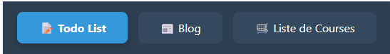
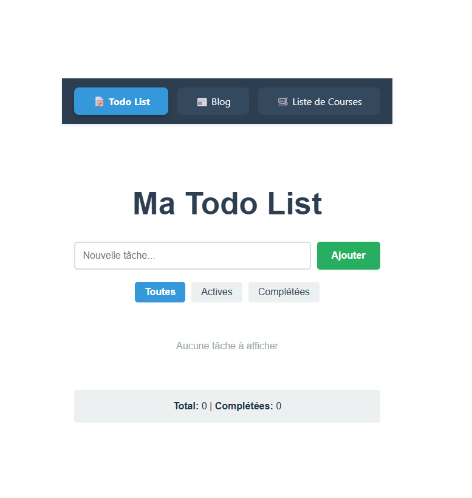
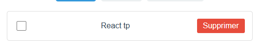
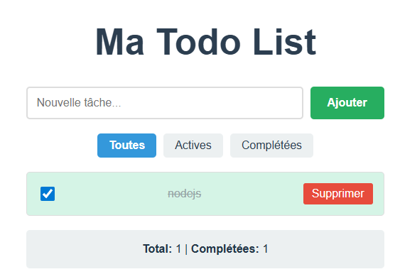
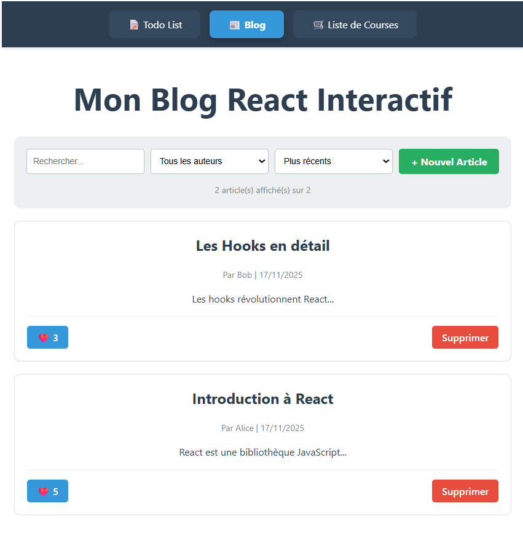
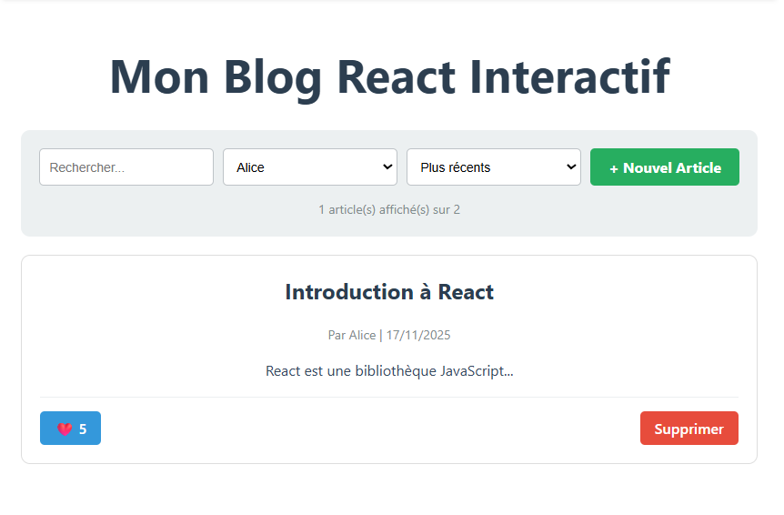
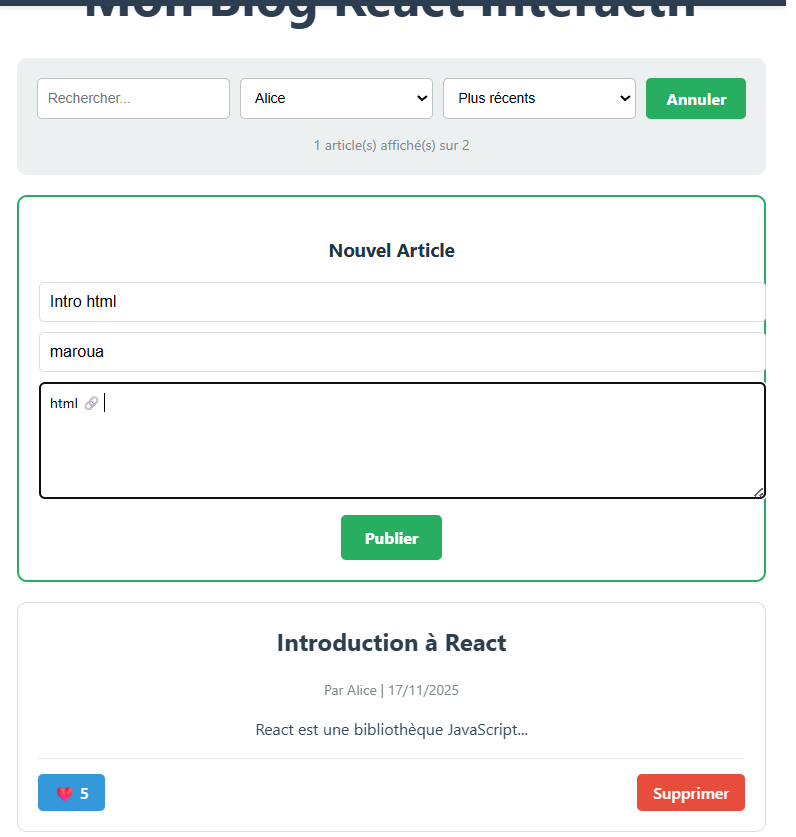
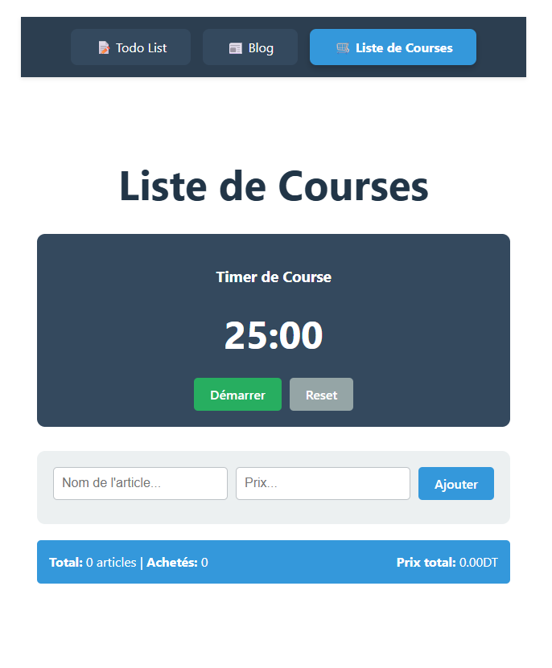
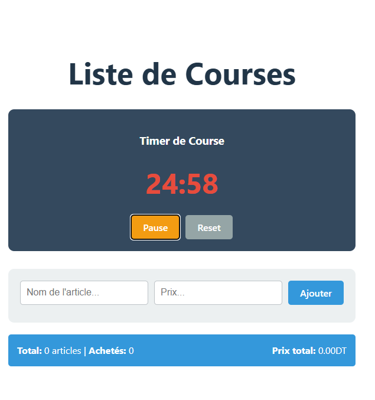
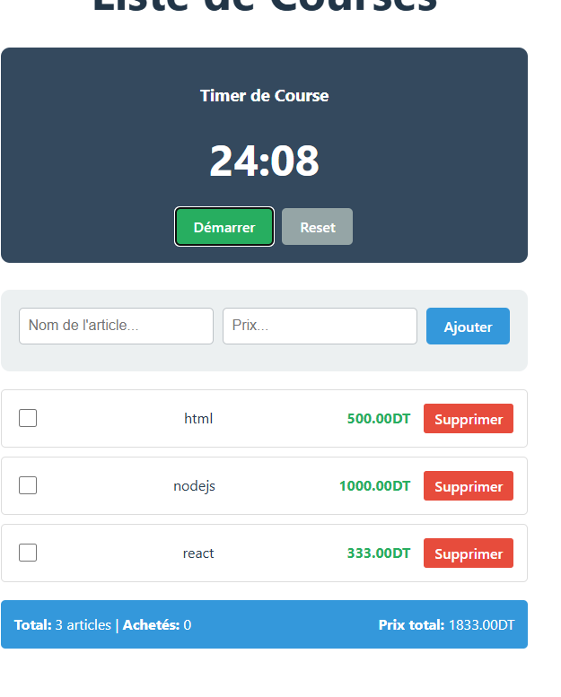

# TP2 - React Hooks Avancés

## 📋 Description du Projet

Ce projet est réalisé dans le cadre du TP2 sur les hooks React avancés (`useReducer`, `useEffect`, `useState`). Il contient **trois applications distinctes** démontrant l'utilisation de ces hooks dans des contextes différents.

## 🎯 Applications Incluses

### 1. **Todo List** (`TodoApp/`)

Application de gestion de tâches complète avec :

- ✅ **useReducer** : Gestion d'état complexe (ajout, suppression, toggle, filtrage)
- ✅ **useEffect** : Persistance dans localStorage
- ✅ **useState** : Gestion du formulaire d'ajout
- Filtres : Toutes / Actives / Complétées
- Statistiques en temps réel
- Sauvegarde automatique

### 2. **Blog** (`BlogApp/`)

Application de blog interactif avec :

- ✅ **useState** : Gestion des articles, formulaires, filtres
- ✅ **useEffect** : Persistance localStorage
- Recherche dans titre/contenu
- Filtre par auteur
- Tri par date ou popularité (likes)
- Ajout/Suppression d'articles
- Système de likes

### 3. **Liste de Courses** (`ShoppingListApp/`)

Application de gestion de courses avec timer Pomodoro :

- ✅ **useState** : Gestion des articles et du timer
- ✅ **useEffect** : Persistance + Timer Pomodoro
- Ajout d'articles avec prix
- Calcul du prix total
- Timer de 25 minutes pour les courses
- Statistiques d'achat

## 🚀 Installation et Lancement

### Prérequis

- Node.js (version 16 ou supérieure)
- npm ou yarn

### Installation

```bash
# Cloner le projet
cd tp2-react

# Installer les dépendances
npm install

# Lancer le serveur de développement
npm run dev
```

L'application sera accessible sur `http://localhost:5173`

## 📁 Structure du Projet

```
tp2-react/
├── src/
│   ├── TodoApp/
│   │   ├── TodoApp.jsx        # Application Todo List
│   │   └── index.js
│   ├── BlogApp/
│   │   ├── BlogApp.jsx        # Application Blog
│   │   └── index.js
│   ├── ShoppingListApp/
│   │   ├── ShoppingListApp.jsx # Application Liste de Courses
│   │   └── index.js
│   ├── reducers/
│   │   └── todoReducer.js     # Reducer pour TodoApp
│   ├── App.jsx                # Navigation principale
│   ├── main.jsx               # Point d'entrée
│   └── index.css              # Styles globaux
├── package.json
└── README.md
```

## 🔧 Fonctionnalités Techniques

### **TodoApp - useReducer**

Le reducer gère 4 actions principales :

```javascript
// 1. ADD_TODO - Ajouter une nouvelle tâche
case 'ADD_TODO':
  return {
    ...state,
    todos: [...state.todos, {
      id: Date.now(),
      text: action.payload,
      completed: false
    }]
  };

// 2. TOGGLE_TODO - Basculer le statut d'une tâche
case 'TOGGLE_TODO':
  return {
    ...state,
    todos: state.todos.map(todo =>
      todo.id === action.payload
        ? { ...todo, completed: !todo.completed }
        : todo
    )
  };

// 3. DELETE_TODO - Supprimer une tâche
case 'DELETE_TODO':
  return {
    ...state,
    todos: state.todos.filter(todo => todo.id !== action.payload)
  };

// 4. SET_FILTER - Changer le filtre d'affichage
case 'SET_FILTER':
  return { ...state, filter: action.payload };

// 5. LOAD_TODOS - Charger depuis localStorage
case 'LOAD_TODOS':
  return { ...state, todos: action.payload };
```

### **useEffect - Explication des Cas**

#### **1. TodoApp - Chargement depuis localStorage**

```javascript
useEffect(() => {
  const saved = localStorage.getItem("todos");
  if (saved) {
    dispatch({ type: "LOAD_TODOS", payload: JSON.parse(saved) });
  }
}, []); // Exécuté une seule fois au montage
```

**Pourquoi ?** Récupère les tâches sauvegardées lors du chargement initial.

#### **2. TodoApp - Sauvegarde automatique**

```javascript
useEffect(() => {
  if (state.todos.length > 0) {
    localStorage.setItem("todos", JSON.stringify(state.todos));
  }
}, [state.todos]); // Exécuté à chaque modification des todos
```

**Pourquoi ?** Sauvegarde automatique dès qu'une tâche est ajoutée/modifiée/supprimée.

#### **3. BlogApp - Persistance des articles**

```javascript
useEffect(() => {
  localStorage.setItem("blog-articles", JSON.stringify(articles));
}, [articles]); // Exécuté à chaque modification des articles
```

**Pourquoi ?** Sauvegarde les articles pour ne pas perdre les données.

#### **4. ShoppingListApp - Timer Pomodoro**

```javascript
useEffect(() => {
  let interval = null;

  if (isActive) {
    interval = setInterval(() => {
      // Logique du timer
    }, 1000);
  }

  return () => {
    if (interval) clearInterval(interval);
  };
}, [isActive, minutes, seconds]); // Nettoyage pour éviter les fuites mémoire
```

**Pourquoi ?**

- Crée un intervalle qui se déclenche chaque seconde
- **Cleanup function** : Nettoie l'intervalle lors du démontage ou changement de dépendances
- Évite les fuites mémoire et comportements inattendus

## 📊 Fonctionnalités par Application

| Fonctionnalité   | TodoApp | BlogApp | ShoppingListApp |
| ---------------- | ------- | ------- | --------------- |
| **useReducer**   | ✅      | ❌      | ❌              |
| **useEffect**    | ✅      | ✅      | ✅              |
| **useState**     | ✅      | ✅      | ✅              |
| **localStorage** | ✅      | ✅      | ✅              |
| **Filtrage**     | ✅      | ✅      | ❌              |
| **Recherche**    | ❌      | ✅      | ❌              |
| **Tri**          | ❌      | ✅      | ❌              |
| **Timer**        | ❌      | ❌      | ✅              |
| **Statistiques** | ✅      | ✅      | ✅              |

## 🎨 Navigation

Le composant `App.jsx` permet de naviguer entre les 3 applications via un menu en haut :

- 📝 **Todo List**
- 📰 **Blog**
- 🛒 **Liste de Courses**

Chaque application fonctionne de manière indépendante avec sa propre gestion d'état.

## 📸 Captures d'Écran

### 1. Navigation Principale


_Menu de navigation permettant de basculer entre les 3 applications_

---

### 2. TodoApp - Gestion de Tâches

#### Vue Générale


_Interface principale avec liste de tâches et statistiques_

#### Ajout d'une Tâche


_Formulaire d'ajout d'une nouvelle tâche_


#### Statistiques


_Affichage des statistiques : Total et nombre de tâches complétées_

---

### 3. BlogApp - Gestion de Blog

#### Vue Générale


_Interface du blog avec liste d'articles_

#### Filtre par Auteur


_Filtrage des articles par auteur_

#### Formulaire d'Ajout d'Article


_Formulaire de création d'un nouvel article_


### 4. ShoppingListApp - Liste de Courses

#### Vue Générale


_Interface complète avec timer et liste d'articles_

#### Timer Actif


_Timer en cours d'exécution (couleur rouge)_

#### Statistiques et Prix Total


_Affichage du nombre d'articles et prix total en DT_

---

## 💾 Persistance des Données

Toutes les applications utilisent `localStorage` pour persister les données :

- **TodoApp** : Clé `'todos'`
- **BlogApp** : Clé `'blog-articles'`
- **ShoppingListApp** : Clé `'shopping-list'`

Les données persistent même après fermeture du navigateur.

## 🔄 Technologies Utilisées

- **React 18** - Bibliothèque UI
- **Vite** - Build tool et dev server
- **JavaScript ES6+** - Langage
- **CSS inline** - Styling
- **localStorage API** - Persistance

## 📝 Notes de Développement

### Hooks Utilisés

1. **useState** : Gestion d'état local simple (formulaires, filtres)
2. **useReducer** : Gestion d'état complexe avec plusieurs actions (TodoApp)
3. **useEffect** : Effets de bord (localStorage, timers, cleanup)

### Bonnes Pratiques Implémentées

- ✅ Cleanup des intervalles dans useEffect
- ✅ Dépendances correctes dans les useEffect
- ✅ Immutabilité de l'état dans le reducer
- ✅ Clés uniques pour les listes (id basé sur timestamp)
- ✅ Validation des formulaires
- ✅ Confirmation avant suppression

## 👨‍🎓 Auteur

Projet réalisé dans le cadre du TP2 - React Hooks Avancés

## 📅 Date de Soumission

Novembre 2025

---
