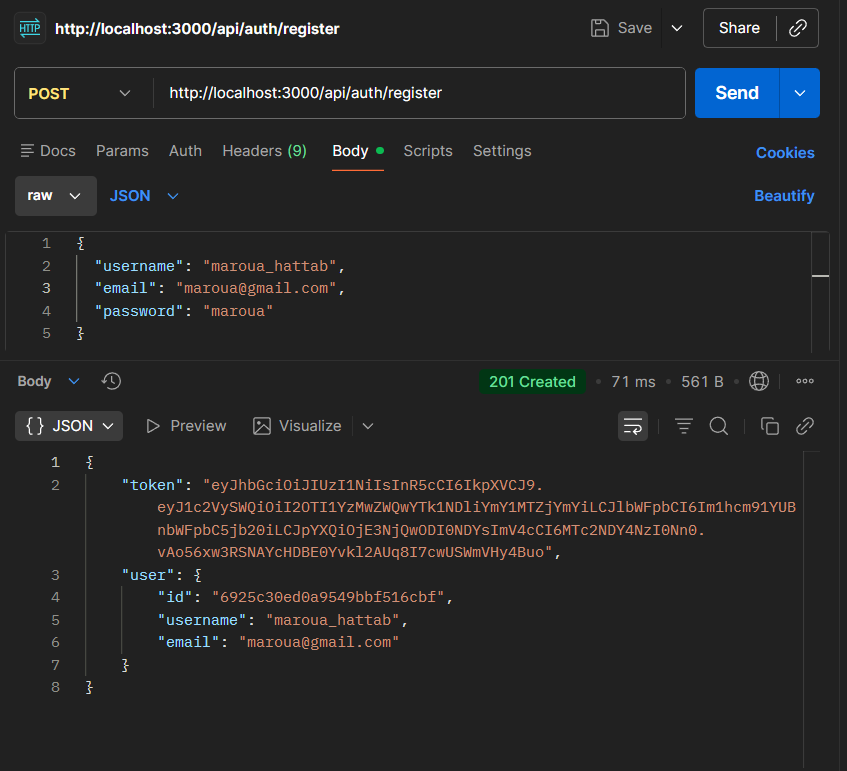
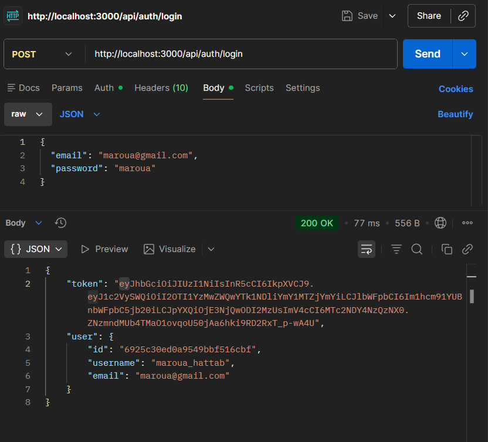
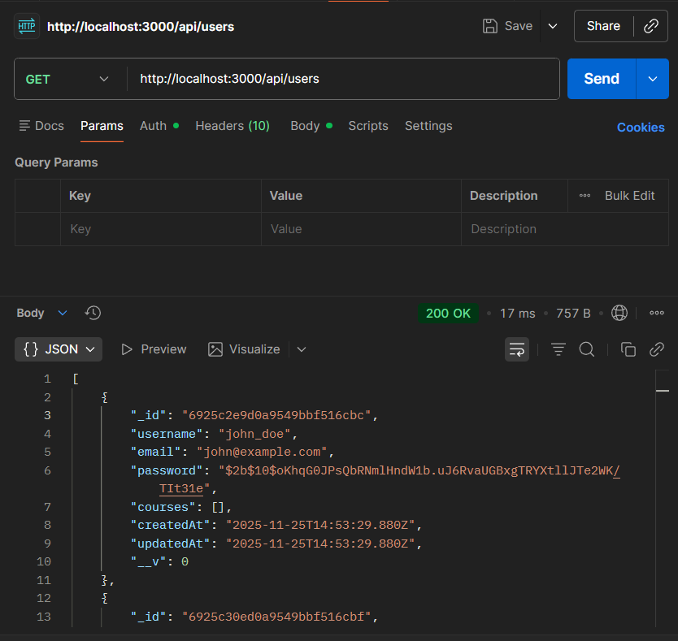
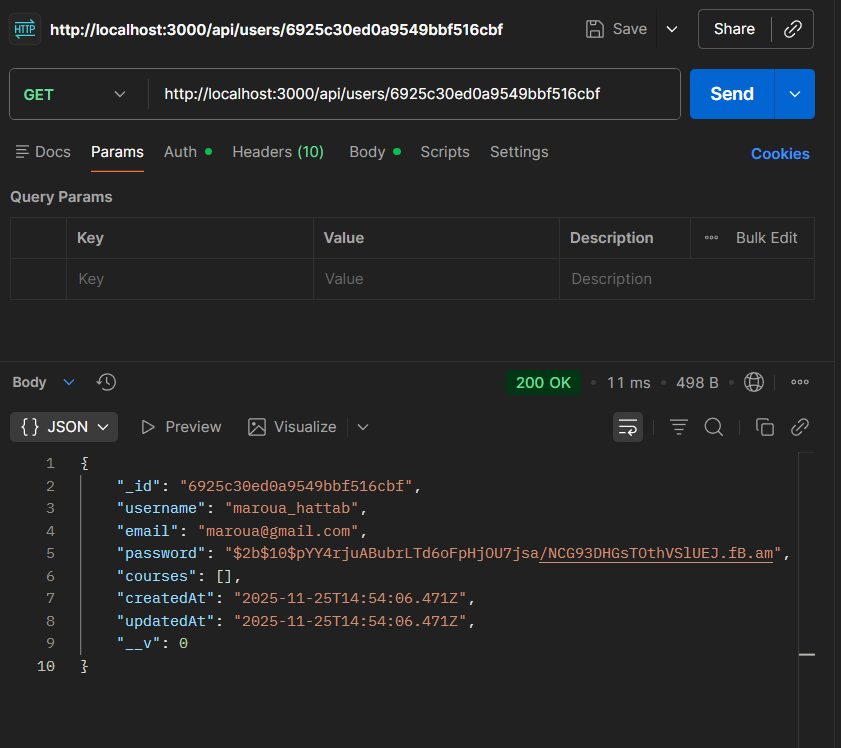

# TP5 - Authentification JWT & API REST MERN

## 📋 Description du TP

**Sujet:** React Router & Authentification JWT  
**Objectif:**  Créer une API REST sécurisée avec authentification JWT pour gérer des utilisateurs, profils, cours et critiques.

---

## 🔐 Authentification JWT

Ce projet implémente une authentification complète par **JSON Web Token (JWT)**. Toutes les routes sensibles sont protégées et nécessitent un token valide.

### **Routes d'Authentification**

#### **1. Inscription (Register)**



```http
POST /api/auth/register
Content-Type: application/json

{
  "username": "maroua_hattab",
  "email": "maroua@gmail.com",
  "password": "maroua"
}
```

**Réponse (201):**
```json
{
  "token": "eyJhbGciOiJIUzI1NiIsInR5cCI6IkpXVCJ9...",
  "user": {
    "id": "6925c30ed0a9549bbf516cbf",
    "username": "maroua_hattab",
    "email": "maroua@gmail.com"
  }
}
```

#### **2. Connexion (Login)**



```http
POST /api/auth/login
Content-Type: application/json

{
  "email": "maroua@gmail.com",
  "password": "maroua"
}
```

**Réponse (200):**
```json
{
  "token": "eyJhbGciOiJIUzI1NiIsInR5cCI6IkpXVCJ9...",
  "user": {
    "id": "6925c30ed0a9549bbf516cbf",
    "username": "maroua_hattab",
    "email": "maroua@gmail.com"
  }
}
```

---

## 🔒 Routes Protégées

### **Utilisateurs** (JWT Requis)

#### **Get All Users** 🔒



```http
GET /api/users
Authorization: Bearer <votre_token_jwt>
```

**Réponse (200):**
```json
[
  {
    "_id": "6925c30ed0a9549bbf516cbf",
    "username": "maroua_hattab",
    "email": "maroua@gmail.com",
    "courses": [...]
  }
]
```

#### **Get User by ID** 🔒



```http
GET /api/users/:id
Authorization: Bearer <votre_token_jwt>
```

**Réponse (200):**
```json
{
  "_id": "6925c30ed0a9549bbf516cbf",
  "username": "maroua_hattab",
  "email": "maroua@gmail.com",
  "courses": [...]
}
```

#### **Get User Courses** 🔒

```http
GET /api/users/:userId/courses
Authorization: Bearer <votre_token_jwt>
```

---

### **Profils** (JWT Requis)

#### **Create Profile** 🔒

```http
POST /api/users/:userId/profile
Authorization: Bearer <votre_token_jwt>
Content-Type: application/json

{
  "bio": "Full-stack developer passionate about MERN stack",
  "website": "https://johndoe.dev"
}
```

#### **Get Profile** 🔒

```http
GET /api/users/:userId/profile
Authorization: Bearer <votre_token_jwt>
```

#### **Update Profile** 🔒

```http
PUT /api/users/:userId/profile
Authorization: Bearer <votre_token_jwt>
Content-Type: application/json

{
  "bio": "Senior MERN Stack Developer",
  "website": "https://newwebsite.com"
}
```

---

### **Cours**

#### **Create Course** 🔒

```http
POST /api/courses
Authorization: Bearer <votre_token_jwt>
Content-Type: application/json

{
  "title": "Introduction à Node.js",
  "description": "Apprenez les bases de Node.js",
  "instructor": "Prof. John Smith"
}
```

#### **Get All Courses** (Public)

```http
GET /api/courses
```

#### **Get Course by ID** (Public)

```http
GET /api/courses/:id
```

#### **Get Course Students** (Public)

```http
GET /api/courses/:courseId/students
```

#### **Enroll in Course** 🔒

```http
POST /api/courses/:courseId/enroll
Authorization: Bearer <votre_token_jwt>
Content-Type: application/json

{
  "userId": "6925c30ed0a9549bbf516cbf"
}
```

---

### **Critiques (Reviews)**

#### **Add Review** 🔒

```http
POST /api/courses/:courseId/reviews
Authorization: Bearer <votre_token_jwt>
Content-Type: application/json

{
  "rating": 5,
  "comment": "Excellent cours!",
  "userId": "6925c30ed0a9549bbf516cbf"
}
```

#### **Get Course Reviews** (Public)

```http
GET /api/courses/:courseId/reviews
```

---

## 🚀 Installation et Configuration

### **1. Installation des dépendances**

```bash
npm install
```

### **2. Configuration de l'environnement**

Créez un fichier `.env` à la racine du projet:

```env
PORT=3000
MONGODB_URI=mongodb://localhost:27017/mern-tp5
JWT_SECRET=votre_secret_jwt_minimum_32_caracteres
NODE_ENV=development
```

**Important:** Générez un JWT_SECRET sécurisé:

```bash
node -e "console.log(require('crypto').randomBytes(64).toString('hex'))"
```

### **3. Démarrage du serveur**

```bash
# Mode développement avec nodemon
npm run dev

# Mode production
npm start
```

Le serveur démarre sur `http://localhost:3000`

---

## 📁 Structure du Projet

```
TP5/
├── config/
│   └── db.js                    # Configuration MongoDB
├── controllers/
│   ├── authController.js        # Authentification (register, login)
│   ├── userController.js        # Gestion utilisateurs
│   ├── profileController.js     # Gestion profils
│   ├── courseController.js      # Gestion cours
│   └── reviewController.js      # Gestion critiques
├── middleware/
│   └── authMiddleware.js        # Middleware JWT protection
├── models/
│   ├── User.js                  # Modèle utilisateur
│   ├── Profile.js               # Modèle profil
│   ├── Course.js                # Modèle cours
│   └── Review.js                # Modèle critique
├── routes/
│   ├── authRoutes.js            # Routes authentification
│   ├── userRoutes.js            # Routes utilisateurs
│   └── courseRoutes.js          # Routes cours
├── img/                         # Captures d'écran
│   ├── register-route.png
│   ├── login-route.png
│   ├── get-users.png
│   └── get-user.png
├── .env                         # Variables d'environnement
├── .gitignore
├── package.json
├── server.js                    # Point d'entrée
├── POSTMAN_TESTS.md            # Guide de test Postman
└── README.md                    # Ce fichier
```

---

## 🗄️ Modèles de Données (MongoDB)

### **User**
```javascript
{
  username: String (required),
  email: String (required, unique),
  password: String (required, hashed with bcrypt),
  courses: [ObjectId] // Référence vers Course
}
```

### **Profile** (Relation 1-to-1 avec User)
```javascript
{
  user: ObjectId (required, unique),
  bio: String,
  website: String
}
```

### **Course**
```javascript
{
  title: String (required),
  description: String (required),
  instructor: String (required),
  students: [ObjectId] // Référence vers User
}
```

### **Review** (Relation 1-to-Many avec Course)
```javascript
{
  rating: Number (required, 1-5),
  comment: String (required),
  course: ObjectId (required),
  user: ObjectId (required)
}
```

---

## 🔗 Relations MongoDB

- **1-to-1**: User ↔ Profile
- **Many-to-Many**: User ↔ Course (via tableaux `courses` et `students`)
- **1-to-Many**: Course → Reviews
- **1-to-Many**: User → Reviews

---

## 🧪 Tests avec Postman

### **1. Importer la collection**

Importez le fichier `MERN_TP5.postman_collection.json` dans Postman.

### **2. Créer un environnement**

Variables Postman:
- `base_url`: `http://localhost:3000`
- `token`: *(vide, sera rempli automatiquement)*
- `user_id`: *(vide)*
- `course_id`: *(vide)*

### **3. Script automatique pour sauvegarder le token**

Dans l'onglet **Tests** de vos requêtes Login/Register:

```javascript
if (pm.response.code === 200 || pm.response.code === 201) {
    const jsonData = pm.response.json();
    pm.environment.set("token", jsonData.token);
    pm.environment.set("user_id", jsonData.user.id);
}
```

### **4. Utiliser le token**

Pour toutes les routes protégées:
- **Onglet Authorization** → Type: **Bearer Token** → Token: `{{token}}`
- Ou manuellement: `Authorization: Bearer {{token}}`

### **5. Ordre de test recommandé**

1. ✅ `POST /api/auth/register` - Créer un compte
2. ✅ `POST /api/auth/login` - Se connecter et récupérer le token
3. 🔒 `GET /api/users` - Lister les utilisateurs
4. 🔒 `GET /api/users/:id` - Voir un utilisateur  
5. 🔒 `POST /api/users/:userId/profile` - Créer un profil
6. 🔒 `POST /api/courses` - Créer un cours
7. 🔒 `POST /api/courses/:courseId/enroll` - S'inscrire à un cours
8. 🔒 `POST /api/courses/:courseId/reviews` - Ajouter une critique
9. 📖 `GET /api/courses/:courseId/reviews` - Voir les critiques

Consultez le fichier **[POSTMAN_TESTS.md](./POSTMAN_TESTS.md)** pour plus de détails.

---

## 🛡️ Sécurité

### **Middleware de Protection JWT**

Fichier: `middleware/authMiddleware.js`

```javascript
const jwt = require('jsonwebtoken');

const protect = (req, res, next) => {
    let token;

    if (req.headers.authorization && req.headers.authorization.startsWith('Bearer')) {
        token = req.headers.authorization.split(' ')[1];

        try {
            const decoded = jwt.verify(token, process.env.JWT_SECRET);
            req.userId = decoded.userId;
            return next();
        } catch (error) {
            return res.status(401).json({ message: 'Token invalide' });
        }
    }

    return res.status(401).json({ message: 'Pas de token, accès refusé' });
};

module.exports = { protect };
```

### **Hashage des mots de passe**

Utilisation de **bcrypt** pour hasher les mots de passe:

```javascript
const bcrypt = require('bcryptjs');
const hashedPassword = await bcrypt.hash(password, 10);
```

### **Expiration des tokens**

Les tokens JWT expirent après **7 jours** (configurable dans `authController.js`).

---

## 📊 Codes de Statut HTTP

| Code | Signification | Usage |
|------|--------------|-------|
| 200 | OK | Requête réussie (GET, PUT) |
| 201 | Created | Ressource créée (POST) |
| 400 | Bad Request | Données invalides |
| 401 | Unauthorized | Token manquant ou invalide |
| 404 | Not Found | Ressource non trouvée |
| 500 | Internal Server Error | Erreur serveur |

---

## 🛠️ Technologies Utilisées

- **Node.js** - Runtime JavaScript
- **Express.js** - Framework web
- **MongoDB** - Base de données NoSQL
- **Mongoose** - ODM pour MongoDB
- **JWT (jsonwebtoken)** - Authentification par token
- **bcryptjs** - Hashage des mots de passe
- **dotenv** - Gestion des variables d'environnement

---

## 📝 Dépendances

```json
{
  "dependencies": {
    "express": "^4.18.2",
    "mongoose": "^8.0.0",
    "dotenv": "^16.3.1",
    "bcryptjs": "^2.4.3",
    "jsonwebtoken": "^9.0.2"
  },
  "devDependencies": {
    "nodemon": "^3.0.1"
  }
}
```

---

## ❌ Erreurs Courantes et Solutions

### **Erreur: "Pas de token, accès refusé"**

```json
{ "message": "Pas de token, accès refusé" }
```

**Solution:** Ajoutez l'en-tête `Authorization: Bearer <token>` à votre requête.

### **Erreur: "Token invalide"**

```json
{ "message": "Token invalide" }
```

**Solutions:**
- Le token est expiré → Reconnectez-vous
- Le token est malformé → Vérifiez le format `Bearer <token>`
- Le `JWT_SECRET` est incorrect → Vérifiez votre fichier `.env`

### **Erreur: "Email déjà utilisé"**

```json
{ "message": "Email déjà utilisé" }
```

**Solution:** Utilisez un autre email ou connectez-vous avec celui-ci.

---

## 👥 Auteur

**Maroua Hattab**  
Poly Project - MERN TP5

---

## 📅 Date

**Création:** Décembre 2025  
**Dernière mise à jour:** 1er Décembre 2025

---

## 📚 Ressources

- [Documentation Express](https://expressjs.com/)
- [Documentation Mongoose](https://mongoosejs.com/)
- [Documentation JWT](https://jwt.io/)
- [Guide de test Postman](./POSTMAN_TESTS.md)

---

**Note:** Ce projet est un travail pratique (TP) visant à apprendre l'authentification JWT et les relations MongoDB dans une stack MERN.
