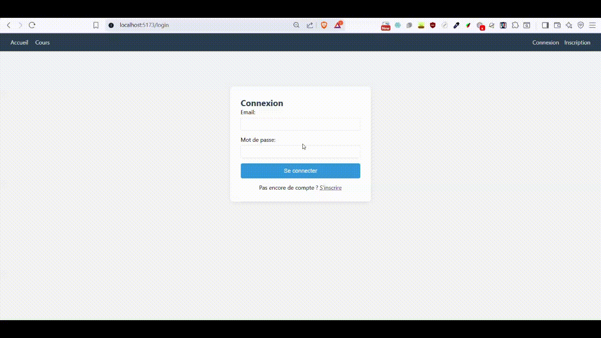

# Cours MERN - TP9 : React Router & Authentification JWT

Application complète de gestion de cours avec authentification JWT, développée avec la stack MERN (MongoDB, Express, React, Node.js).

## 🎬 Démonstration

Voici une démonstration complète de toutes les fonctionnalités de l'application :



*Cette démo présente l'ensemble des fonctionnalités : inscription, connexion, navigation entre les pages, recherche et pagination des cours, consultation des détails, ajout de reviews, gestion du profil, et bien plus encore.*

## 📋 Table des Matières

- [Fonctionnalités](#fonctionnalités)
- [Technologies Utilisées](#technologies-utilisées)
- [Prérequis](#prérequis)
- [Installation](#installation)
- [Configuration](#configuration)
- [Démarrage](#démarrage)
- [Structure du Projet](#structure-du-projet)
- [Routes API](#routes-api)
- [Pages Frontend](#pages-frontend)
- [Captures d'Écran](#captures-décran)

## ✨ Fonctionnalités

### Authentification
- ✅ Inscription avec email, username et mot de passe
- ✅ Connexion avec génération de token JWT
- ✅ Protection des routes nécessitant l'authentification
- ✅ Déconnexion

### Gestion des Cours
- ✅ Liste de tous les cours disponibles
- ✅ Pagination (10 cours par page)
- ✅ Recherche de cours par titre
- ✅ Détails d'un cours
- ✅ Inscription à un cours (pour utilisateurs authentifiés)

### Gestion des Reviews
- ✅ Ajout d'une review sur un cours (avec note de 1 à 5 étoiles et commentaire)
- ✅ Visualisation des reviews d'un cours
- ✅ Page "Mes Reviews" listant toutes les reviews de l'utilisateur

### Gestion du Profil
- ✅ Affichage du profil utilisateur
- ✅ Édition du profil (bio et site web)
- ✅ Liste des cours auxquels l'utilisateur est inscrit

### Autres
- ✅ Page 404 pour les routes inexistantes
- ✅ Navigation responsive avec Navbar

## 🛠 Technologies Utilisées

### Backend
- **Node.js** - Environnement d'exécution JavaScript
- **Express.js** - Framework web
- **MongoDB** - Base de données NoSQL
- **Mongoose** - ODM pour MongoDB
- **JWT** (jsonwebtoken) - Authentification par token
- **bcryptjs** - Hashage des mots de passe
- **CORS** - Gestion des requêtes cross-origin
- **dotenv** - Gestion des variables d'environnement

### Frontend
- **React** - Bibliothèque UI
- **React Router** - Gestion du routing
- **Axios** - Client HTTP
- **Vite** - Build tool

## 📦 Prérequis

Avant de commencer, assurez-vous d'avoir installé :

- **Node.js** (version 14 ou supérieure)
- **npm** ou **yarn**
- **MongoDB** (local ou Atlas)

## 🚀 Installation

### 1. Cloner le repository

```bash
git clone <repository-url>
cd tp9
```

### 2. Installation des dépendances Backend

```bash
cd backend
npm install
```

### 3. Installation des dépendances Frontend

```bash
cd ../frontend
npm install
```

## ⚙️ Configuration

### Backend (.env)

Créez un fichier `.env` dans le dossier `backend` (voir `.env.example`):

```env
PORT=3000
MONGO_URI=mongodb://localhost:27017/tp9_mern
JWT_SECRET=votre_secret_jwt_super_securise_ici
```

**Variables d'environnement:**
- `PORT` : Port du serveur backend (par défaut 3000)
- `MONGO_URI` : URI de connexion MongoDB
- `JWT_SECRET` : Clé secrète pour signer les tokens JWT

### Frontend

Le frontend est configuré pour communiquer avec le backend sur `http://localhost:3000`.

Si vous changez le port du backend, modifiez l'URL dans `frontend/src/api/axios.js`:

```javascript
const api = axios.create({
  baseURL: 'http://localhost:VOTRE_PORT/api',
  // ...
});
```

## 🎯 Démarrage

### 1. Démarrer MongoDB

Assurez-vous que MongoDB est en cours d'exécution :

```bash
# Si MongoDB est installé localement
mongod
```

Ou utilisez MongoDB Atlas (cloud).

### 2. Démarrer le Backend

```bash
cd backend
npm start
```

Le serveur backend démarre sur `http://localhost:3000`

### 3. Démarrer le Frontend

Dans un nouveau terminal :

```bash
cd frontend
npm run dev
```

Le frontend démarre sur `http://localhost:5173`

### 4. Accéder à l'application

Ouvrez votre navigateur et accédez à : `http://localhost:5173`

## 📁 Structure du Projet

```
tp9/
├── backend/
│   ├── config/
│   │   └── db.js                 # Configuration MongoDB
│   ├── controllers/
│   │   ├── authController.js     # Contrôleurs auth (login, register)
│   │   ├── courseController.js   # Contrôleurs cours
│   │   ├── profileController.js  # Contrôleurs profil
│   │   ├── reviewController.js   # Contrôleurs reviews
│   │   └── userController.js     # Contrôleurs utilisateurs
│   ├── middleware/
│   │   └── authMiddleware.js     # Middleware JWT
│   ├── models/
│   │   ├── Course.js             # Modèle Cours
│   │   ├── Profile.js            # Modèle Profil
│   │   ├── Review.js             # Modèle Review
│   │   └── User.js               # Modèle Utilisateur
│   ├── routes/
│   │   ├── authRoutes.js         # Routes auth
│   │   ├── courseRoutes.js       # Routes cours
│   │   └── userRoutes.js         # Routes utilisateurs
│   ├── .env                      # Variables d'environnement
│   ├── server.js                 # Point d'entrée
│   └── package.json
│
└── frontend/
    ├── src/
    │   ├── api/
    │   │   └── axios.js          # Configuration Axios
    │   ├── components/
    │   │   ├── Navbar.jsx        # Barre de navigation
    │   │   └── ProtectedRoute.jsx # Composant route protégée
    │   ├── context/
    │   │   └── AuthContext.jsx   # Contexte d'authentification
    │   ├── pages/
    │   │   ├── Home.jsx          # Page d'accueil
    │   │   ├── Login.jsx         # Page de connexion
    │   │   ├── Register.jsx      # Page d'inscription
    │   │   ├── Courses.jsx       # Liste des cours (avec recherche et pagination)
    │   │   ├── CourseDetails.jsx # Détails d'un cours (avec formulaire review)
    │   │   ├── Profile.jsx       # Page profil
    │   │   ├── ProfileEdit.jsx   # Édition du profil
    │   │   ├── MyReviews.jsx     # Mes reviews
    │   │   └── NotFound.jsx      # Page 404
    │   ├── App.jsx               # Composant principal
    │   ├── main.jsx              # Point d'entrée
    │   └── index.css             # Styles globaux
    ├── index.html
    ├── vite.config.js
    └── package.json
```

## 🔌 Routes API

### Authentification
| Méthode | Route | Description | Authentification |
|---------|-------|-------------|-----------------|
| POST | `/api/auth/register` | Inscription | Non |
| POST | `/api/auth/login` | Connexion | Non |

### Utilisateurs
| Méthode | Route | Description | Authentification |
|---------|-------|-------------|-----------------|
| GET | `/api/users` | Liste des utilisateurs | Oui (JWT) |
| GET | `/api/users/:id` | Détails d'un utilisateur | Oui (JWT) |
| GET | `/api/users/:userId/courses` | Cours d'un utilisateur | Oui (JWT) |
| GET | `/api/users/:userId/reviews` | Reviews d'un utilisateur | Oui (JWT) |

### Profils
| Méthode | Route | Description | Authentification |
|---------|-------|-------------|-----------------|
| POST | `/api/users/:userId/profile` | Créer un profil | Oui (JWT) |
| GET | `/api/users/:userId/profile` | Obtenir un profil | Oui (JWT) |
| PUT | `/api/users/:userId/profile` | Modifier un profil | Oui (JWT) |

### Cours
| Méthode | Route | Description | Authentification |
|---------|-------|-------------|-----------------|
| GET | `/api/courses` | Liste des cours | Non |
| GET | `/api/courses/:id` | Détails d'un cours | Non |
| POST | `/api/courses` | Créer un cours | Oui (JWT) |
| POST | `/api/courses/:courseId/enroll` | S'inscrire à un cours | Oui (JWT) |
| GET | `/api/courses/:courseId/students` | Étudiants d'un cours | Non |

### Reviews
| Méthode | Route | Description | Authentification |
|---------|-------|-------------|-----------------|
| GET | `/api/courses/:courseId/reviews` | Reviews d'un cours | Non |
| POST | `/api/courses/:courseId/reviews` | Ajouter une review | Oui (JWT) |

## 🖼 Pages Frontend

### Pages Publiques
- **/** - Page d'accueil
- **/login** - Connexion
- **/register** - Inscription
- **/courses** - Liste des cours (avec recherche et pagination)
- **/courses/:id** - Détails d'un cours

### Pages Protégées (nécessitent authentification)
- **/profile** - Profil utilisateur
- **/profile/edit** - Édition du profil
- **/my-reviews** - Mes reviews

### Page d'erreur
- ***** (wildcard) - Page 404 Not Found

## 📸 Captures d'Écran

Les captures d'écran de toutes les pages sont disponibles dans le dossier `img/`.

### Liste des captures:
1. **home.png** - Page d'accueil
2. **login.png** - Page de connexion
3. **register.png** - Page d'inscription
4. **courses.png** - Liste des cours avec recherche
5. **course-details.png** - Détails d'un cours avec avis
6. **add-review.png** - Formulaire d'ajout de review
7. **profile.png** - Page profil
8. **profile-edit.png** - Édition du profil
9. **my-reviews.png** - Page mes reviews
10. **404.png** - Page Not Found

## 🔐 Sécurité

- Les mots de passe sont hashés avec **bcryptjs** avant stockage
- Les routes sensibles sont protégées par **JWT middleware**
- Les tokens JWT sont stockés dans le localStorage côté client
- CORS est configuré pour accepter uniquement les requêtes du frontend

## 🐛 Dépannage

### Le backend ne démarre pas
- Vérifiez que MongoDB est en cours d'exécution
- Vérifiez que le fichier `.env` est correctement configuré
- Vérifiez que le port 3000 n'est pas déjà utilisé

### Le frontend ne se connecte pas au backend
- Vérifiez que le backend est en cours d'exécution sur le port 3000
- Vérifiez la configuration CORS dans `backend/server.js`
- Vérifiez l'URL de base dans `frontend/src/api/axios.js`

### Erreur d'authentification
- Vérifiez que le token JWT est correctement stocké dans localStorage
- Vérifiez que le header Authorization est bien envoyé avec les requêtes

## 👨‍💻 Développement

### Créer de nouveaux cours (via API)

Utilisez Postman ou tout autre client HTTP pour créer des cours :

```bash
POST http://localhost:3000/api/courses
Headers: 
  Authorization: Bearer <votre_token_jwt>
  Content-Type: application/json
Body:
{
  "title": "React Avancé",
  "description": "Maîtrisez React avec les hooks avancés",
  "instructor": "Jane Doe"
}
```

## 📝 Licence

Ce projet est réalisé dans le cadre du cours MERN - Semaine 9.

## 👥 Auteur

Développé pour le TP9 du cours MERN - React Router & Authentification JWT

---

**Note**: Ce projet est à des fins éducatives uniquement.
